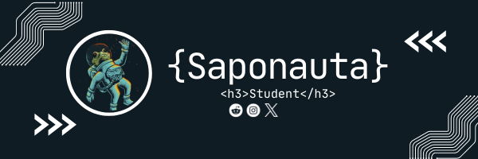

# 💫 About Me:
Hello! I am Pedro, a student passionate about the world of programming. I am currently learning various languages and technologies to develop my skills and build interesting projects. This repository is a reflection of my learning journey and contains various projects and exercises I have created along the way.

## 🌐 Socials:
   

# 💻 Tech Stack:
   
# 📊 GitHub Stats:
 
 

### ✍️ Random Dev Quote

### 😂 Random Dev Meme

---

<!-- Proudly created with GPRM ( https://gprm.itsvg.in ) -->
